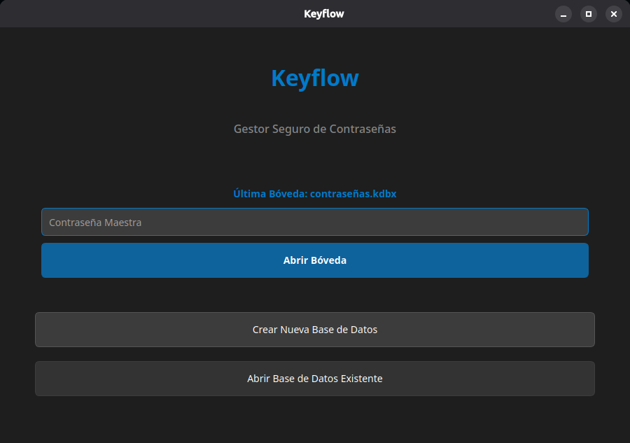
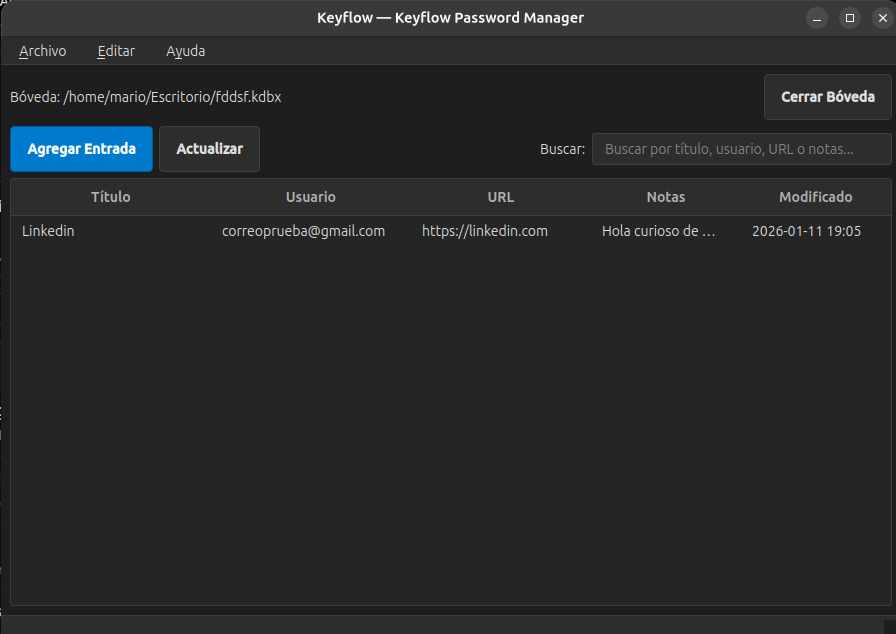

# Keyflow Password Manager

<div align="center">


**Un gestor de contraseñas seguro, moderno y de código abierto compatible con archivos .kdbx**

[](https://www.python.org/)
[](LICENSE)
[](https://keepass.info/)

</div>

---

## 📖 Descripción

Keyflow es un gestor de contraseñas moderno desarrollado con Python y PySide6 que te permite almacenar y gestionar tus credenciales de forma segura utilizando el formato estándar `.kdbx` de KeePass.

### ✨ Características Principales

- 🔐 **Cifrado Robusto**: Compatible con archivos `.kdbx` (KeePass Database)
- 🎨 **Interfaz Moderna**: Tema oscuro con diseño limpio e intuitivo
- ⚡ **Optimizado**: Tiempos de carga reducidos mediante KDF optimizado
- 🔑 **Generador de Contraseñas**: Crea contraseñas seguras automáticamente
- 🕒 **Timer de Portapapeles**: Limpieza automática del portapapeles (12 segundos)
- 💾 **Última Bóveda**: Acceso rápido a tu bóveda más reciente
- 🌐 **Menús en Español**: Interfaz completamente localizada
- 📋 **Copiar con Seguridad**: Copia usuario, contraseña y URL con un clic

---

## 🖼️ Capturas de Pantalla
 
 ### Pantalla de Inicio
 
 
 ### Vista de la Bóveda
 

---

## 📦 Instalación

### Opción 1: Instalar mediante Snap (Recomendado)

Si tu sistema soporta paquetes Snap (Ubuntu, Manjaro, Linux Mint, etc.), simplemente ejecuta:

```bash
sudo snap install keyflow
```

### Opción 2: Instalar Paquete .deb

Descarga el último release desde GitHub y ejecútalo:

```bash
sudo apt install ./keyflow_1.0.1_amd64.deb
```

---

## 🚀 Ejecutar la aplicación

Después de la instalación, puedes ejecutar Keyflow de dos formas:

1. **Desde el menú de aplicaciones**: Busca "Keyflow" en el menú de tu sistema
2. **Desde la terminal**:
   ```bash
   keyflow
   ```

### Desinstalar

Para desinstalar Keyflow completamente:

```bash
# Si instalaste mediante Snap
sudo snap remove keyflow

# Si instalaste mediane .deb
sudo apt remove keyflow
```

### Ejecutar la aplicación

Después de la instalación, puedes ejecutar Keyflow de dos formas:

1. **Desde el menú de aplicaciones**: Busca "Keyflow Password Manager" en el menú de tu sistema
2. **Desde la terminal**:
   ```bash
   keyflow
   ```

### Desinstalar

Para desinstalar Keyflow completamente:

```bash
sudo apt remove keyflow
```

---

## 🛡️ Seguridad

- **Cifrado**: AES-256 para almacenamiento de datos
- **KDF Optimizado**: Argon2 con iteraciones ajustables (por defecto: 2 para rendimiento)
- **Limpieza de Portapapeles**: Automática después de 12 segundos
- **Sin Almacenamiento en Claro**: Las contraseñas nunca se guardan sin cifrar

---

## 🏗️ Estructura del Proyecto

```
keyflow/
├── assets/              # Recursos (logo, imágenes)
├── src/
│   ├── database.py      # Lógica de base de datos (pykeepass)
│   └── ui/
│       ├── main_window.py    # Ventana principal
│       ├── start_screen.py   # Pantalla de inicio
│       ├── entry_dialog.py   # Diálogo de entrada
│       ├── login_window.py   # Ventana de login
│       └── styles.py         # Estilos CSS/QSS
├── main.py             # Punto de entrada
├── requirements.txt    # Dependencias
└── README.md           # Este archivo
```

---

## 📝 Licencia

Este proyecto está bajo la Licencia MIT - ver el archivo [LICENSE](LICENSE) para más detalles.

---

## 👤 Autor

**Maalfer**

- GitHub: [@Maalfer](https://github.com/Maalfer)
- LinkedIn: [maalfer1](https://www.linkedin.com/in/maalfer1/)
- Proyecto: [Keyflow](https://github.com/Maalfer/keyflow)

---


## 🐛 Reportar Bugs

Si encuentras algún error o tienes problemas con la aplicación, por favor repórtalo en nuestra sección de Issues:
[https://github.com/Maalfer/keyflow/issues](https://github.com/Maalfer/keyflow/issues)

## 🗺️ Próximos Objetivos (Roadmap)

- [ ] ✅ **Soporte Windows**: Próximamente disponible instalador `.exe` y `.msi`.
- [ ] ✅ **Soporte Flatpak**: Próximamente disponible en Flathub para mayor compatibilidad entre distribuciones.

---

<div align="center">

**⭐ Si te gusta Keyflow, dale una estrella en GitHub! ⭐**

[](https://star-history.com/#Maalfer/keyflow&Date)


</div>
